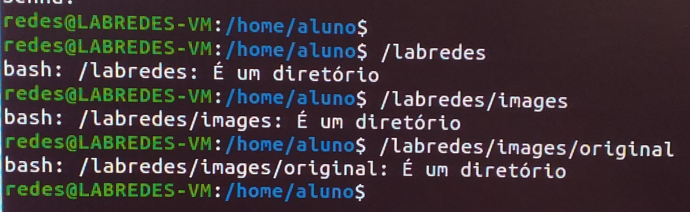

# Etapa 01 - Terminal

A partir daqui você aprenderá a configurar e executar um ambiente de rede virtualizada:

## 1.1 - Login 

É necessário, primeiramente, logar no terminal para dá procedimento no projeto.

Imagem 01 - Logando em su redes.


Após, só é inserir a senha: ```admin@Lab92```

A senha fica invisível, então atente-se ao digitá-la. Caso erre, tente novamente.

## 1.2 - Criar pastas

Agora, é preciso criar a pasta labredes na raiz / e subpastas, mas antes de tudo, é preciso verificar se elas já existem como na imagem a seguir, em caso de não ser a primeira vez configurando uma VM com esses passos.:

Imagem 02 - Verificando existência das pastas e subpastas.



Agora vamos para a criação dos diretórios: 

Primeiro vamos entrar na raiz:

```cd /```

Em seguida usamos o comando ```mkdir``` para a criação dos diretórios. Para a criação de labredes temos:

```
sudo mkdir /labredes //criando a pasta labredes
```

Prosseguindo, é preciso criar a pasta ```images``` e ```original``` dentro de /labredes:

```
cd /labredes        //entrando em labredes 
sudo mkdir images   //criando subpasta images
cd images           //entrando em images
sudo mkdir original //criando subpasta original
```

Para verificar basta entrar em original e imputar o comando:

```
cd original
ls -la
```

Voltando para o diretório ```labredes```, precisamos criar os diretórios referentes aos usuários da máquina em questão:

```md
cd /
sudo mkdir labredes/VM
sudo mkdir labredes/VM/913
sudo mkdir labredes/VM/913/<estudante> //substituir <estudante> pelo o nome que quiser imputar
```

No lugar de <estudante>, no nosso caso, como são 4 PCs com 4 usuários, substituimos pelos os nossos nomes. Assim o comando anterior será o seguinte para cada PC:
No terminal de cada PC:
  
* No PC 01: ```sudo mkdir ronaldo```
* No PC 02: ```sudo mkdir mayara```
* No PC 03: ```sudo mkdir philype```
* No PC 04: ```sudo mkdir grupo8```
  
Criando da pasta do usuário ronaldo:
  


Verifcando a existência dos diretórios do usuário ronaldo:


  
Os comandos para a verificação:

```
/labredes/images/original
/labredes/VM/913/<NomeDoAluno>
```

Agora, vamos permitir que o usuário possa acessar os arquivos e pastas. Depois de está no diretório do seu nome, é necessário adicionar os usuários ao grupo redes:
  
```
sudo usermod -aG redes aluno
```

Agora, com o comando ```chown``` modificamos o dono da pasta labredes para o usuario nobody e grupo nogroup
  
```
 sudo chown -R nobody:nogroup /labredes
```
```
 ls -la
 sudo chgrp -R redes /labredes
 sudo chmod -R 771 /labredes 
 ls -la
 getent group  #lista grupos: observe no fim da lista que os usuários também possuem grupos
```
  

A ordem desses comando não altera os fatores, ou seja, não necessariamente tem que nessa ordem:
  

  
Só após esses comandos a pasta estará liberada para a importação das VMs.
  
Após devemos verificar se nos existe os seguintes arquivos no diretório /labredes/images/original:
  
```
mini.iso
ubuntu-20.04.4-desktop-amd64.iso
ubuntu-22.04-live-server-amd64.iso
```
  
Verifique com:
  
```
cd /labredes/images/original
ls -la
```
  
Caso não tenha você deverá imputar os seguintes comandos: 
 
```
scp aluno@192.168.101.10:~/Public/iso-images/mini.iso /labredes/images/original
scp aluno@192.168.101.10:~/Public/iso-images/ubuntu-20.04.4-desktop-amd64.iso /labredes/images/original
scp aluno@192.168.101.10:~/Public/iso-images/ubuntu-22.04-live-server-amd64.iso /labredes/images/original
```
