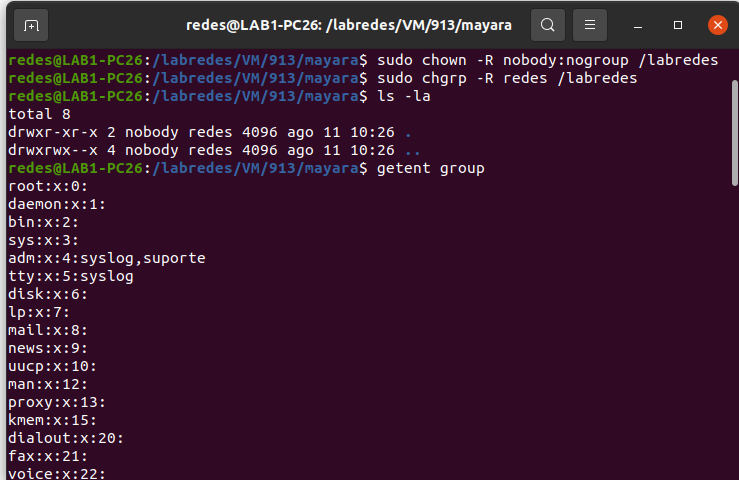

# Etapa 01 - Terminal

A partir daqui você aprenderá a configurar e executar um ambiente de rede virtualizada:

## 1.1 - Login 

É necessário, primeiramente, logar no terminal para dá procedimento no projeto.


## 1.2 - Criar pastas

É preciso criar a pasta labredes na raiz / e subpastas:

```
sudo mkdir /labredes //criando a pasta labredes
```

É preciso criar a pasta images dentro de /labredes:

```
cd /labredes        //entrando em labredes 
sudo mkdir images   //criando subpasta images
cd images           //entrando em images
sudo mkdir original //criando subpasta original
```

Para verificar basta entrar em original e imputar o comando:

```
cd original
ls -la
```

Agora é preciso criar os diretórios e subdiretórios:


```md
cd /
sudo mkdir labredes/VM
sudo mkdir labredes/VM/913
sudo mkdir labredes/VM/913/<estudante>
```

No lugar de <estudante>, no nosso caso, substituimos pelos os nossos nomes. Assim o comando anterior será o seguinte para cada PC:
  
* No PC 01: sudo mkdir ronaldo
* No PC 02: sudo mkdir mayara
* No PC 03: sudo mkdir philype
* No PC 04: sudo mkdir grupo8

Verifcando a existência dos diretórios:


```
/labredes/images/original
/labredes/VM/913/<NomeDoAluno>
```

Depois de está no diretório do seu nome você deverá colocar os seguintes comando:
  
```
 sudo chown -R nobody:nogroup /labredes
 ls -la
 sudo chgrp -R redes /labredes
 sudo chmod -R 771 /labredes 
 ls -la
 getent group  #lista grupos: observe no fim da lista que os usuários também possuem grupos
```
  

  
Após devemos verificar se nos existe os seguintes arquivos no diretório /labredes/images/original:
  
```
mini.iso
ubuntu-20.04.4-desktop-amd64.iso
ubuntu-22.04-live-server-amd64.iso
```
  
Verifique com:
  
```
cd /labredes/images/original
ls -la
```
  
Caso não tenha você deverá imputar os seguintes comandos: 
 
```
scp aluno@192.168.101.10:~/Public/iso-images/mini.iso /labredes/images/original
scp aluno@192.168.101.10:~/Public/iso-images/ubuntu-20.04.4-desktop-amd64.iso /labredes/images/original
scp aluno@192.168.101.10:~/Public/iso-images/ubuntu-22.04-live-server-amd64.iso /labredes/images/original
```
