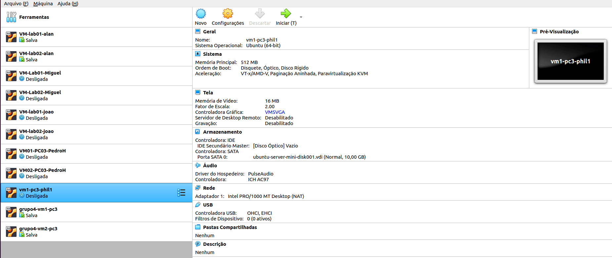
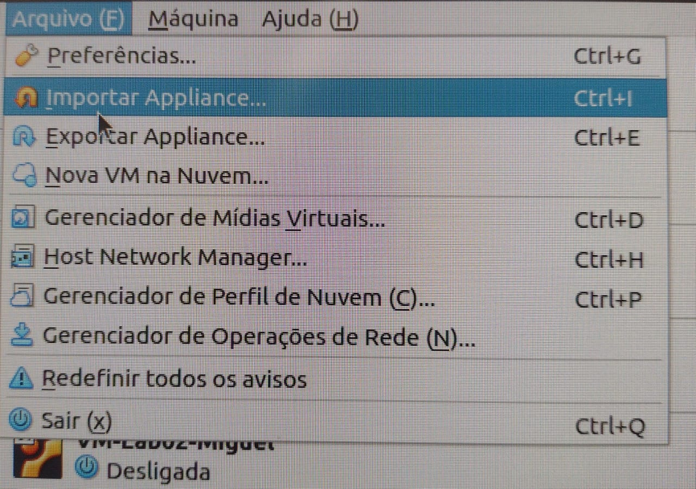
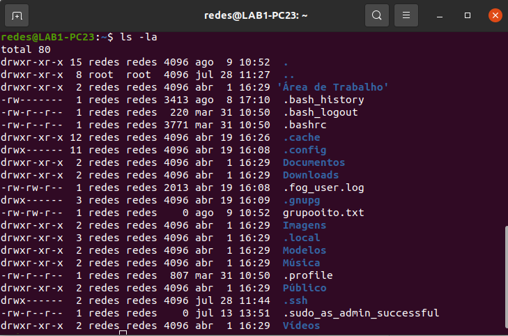
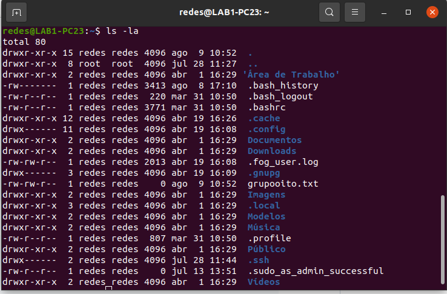

# Na VM

## 1 - Instalando o Virtualbox Extension Pack

```
su redes
sudo apt install virtualbox-ext-pack
```

## 2 - Importando VMs no VirtualBox

No VitualBox vá em arquivo:



Em arquivos vá em importar Appliance:



E assim aparecerá na tela:



Depois, você deverá importar o arquivo .ova na pastinha, colocar seu nome no asterisco verde e escolher a pasta com o seu nome que você criou nos passo passado:


