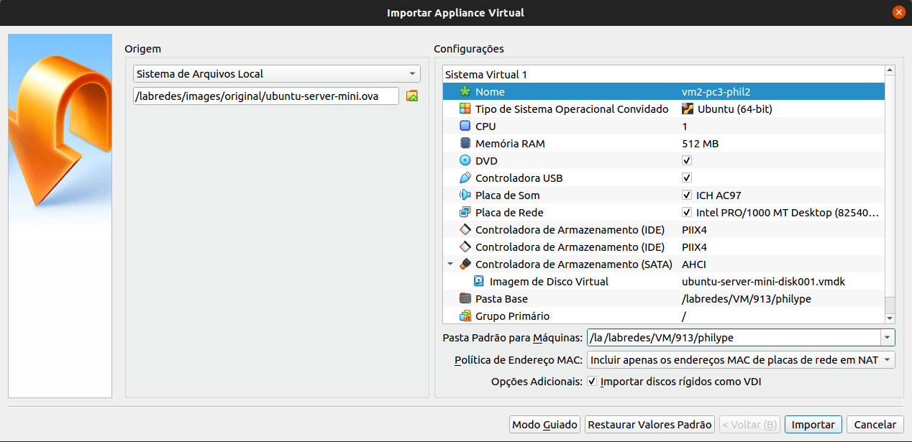

# Na VM

## 1 - Instalando o Virtualbox Extension Pack

```
su redes
sudo apt install virtualbox-ext-pack
```

## 2 - Importando VMs no VirtualBox

No VitualBox vá em arquivo:


Em arquivos vá em importar Appliance:


E assim aparecerá a seguinte tela:


Nela você deverá importar o arquivo .ova na pastinha, colocar seu nome no asterisco verde e escolher a pasta com o seu nome que você criou nos passos passado:



Clique em importar e pronto! Sua máquina virtual foi criada.

Contudo, como são necessário duas VMS para cada PC neste projeto, é preciso criar uma outra máquina virtual. Então, você tem duas opções:

- Cria a segunda VM manual, novamente.
ou
- Clona a sua primeira VM criada alterando as configurações para as pré-determinadas para ela. (Opção mais viável)
