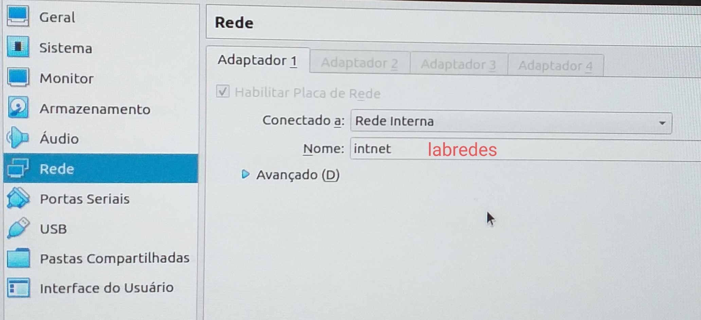
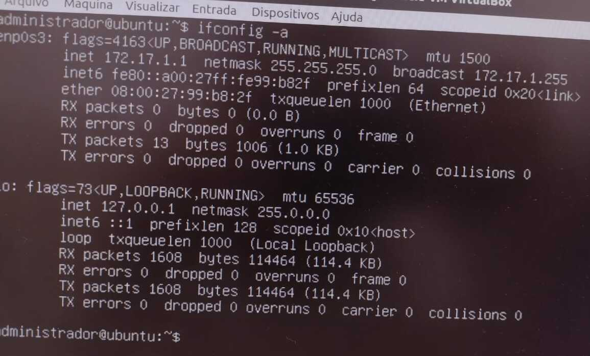
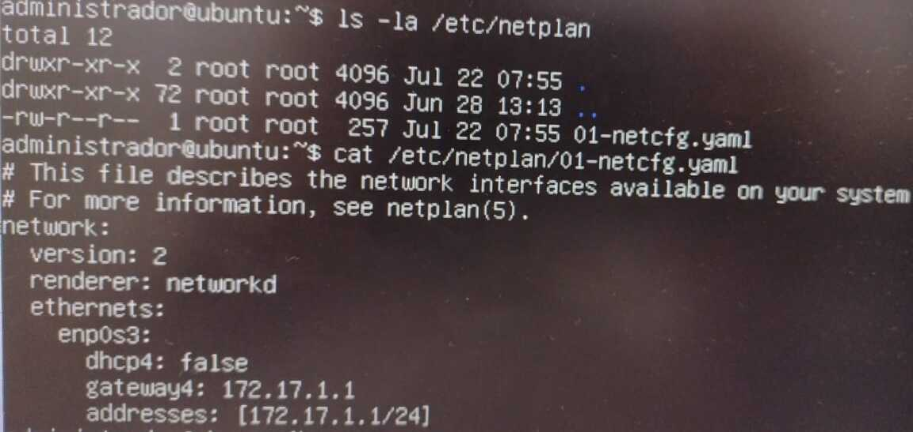
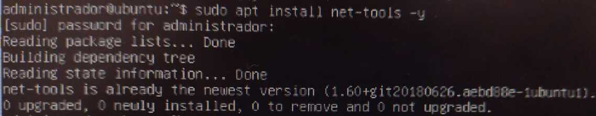
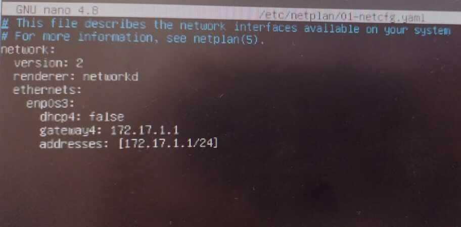
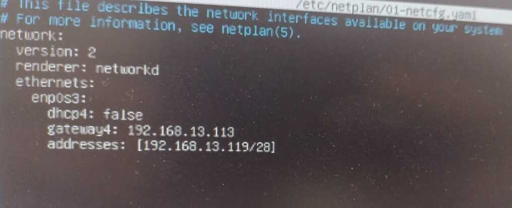
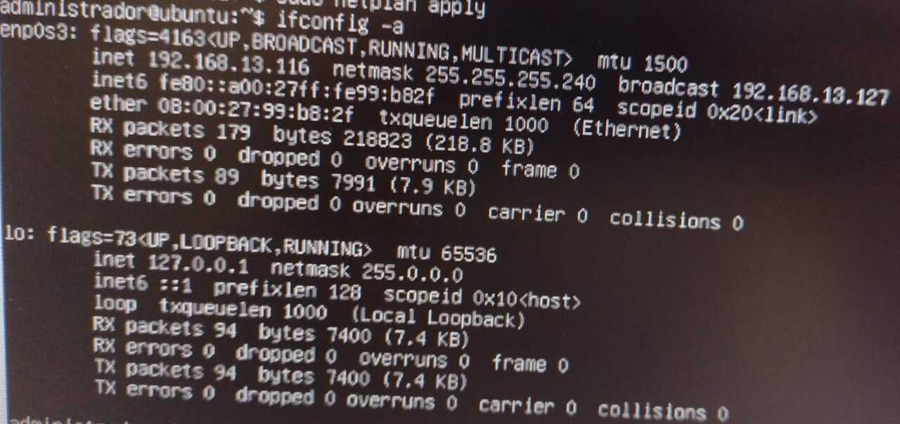
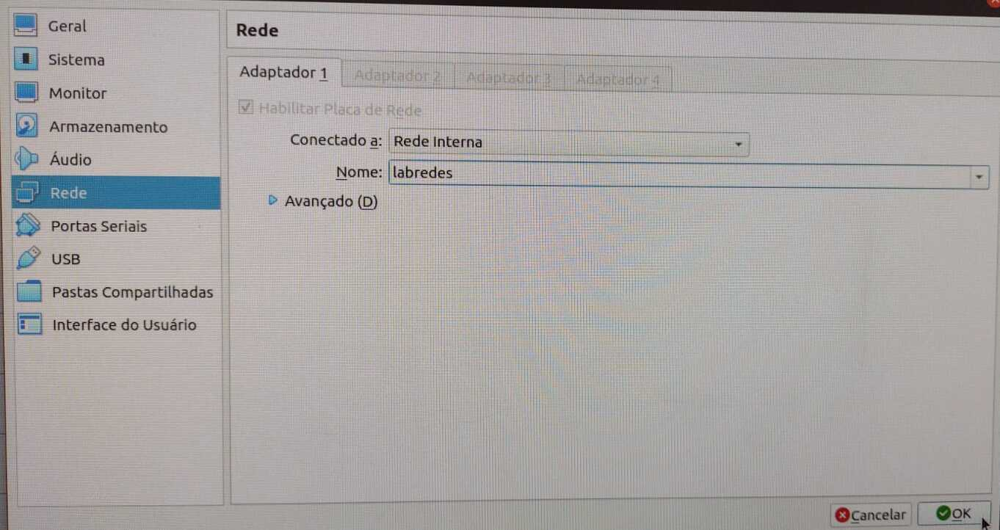
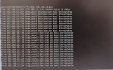

# No terminal das VMs

## 1 - Configuração das NICs

Para que a VMs utilizem a mesma rede interna é necessário acessar as configurações de Rede de cada VM e selecionar o modo ```rede interna``` e definir o nome da rede, vamos escolher ```labredes``` como nome da nossa rede virtual. Utilize o mesmo nome nas duas VMs.

Imagem 01 - Configuração das NICS.



## 2 - Login nas VMs

Entre com as informações:

```
Usuário da VM: administrador
Senha da VM: adminifal
```

## 3 - Configuração estática do endereço IP na interface de rede

- O Ubuntu utiliza um arquivo YAML para configurar as interfaces de rede
- este arquivo se contra na pasta /etc/netplan/

Digite:

```
ifconfig -a
ls -la /etc/netplan
cat /etc/netplan/01-netcfg.yaml
```

Verifique o nome correto do arquivo no seu servidor. No nosso caso, o nome do arquivo é ```01-netcfg.yaml```.

Imagens 02 e 03 - Sequência dos comando acima.

Imagem 02.



Imagem 03.



Após o login, nas VMS, é necessário fazer a instalação das ferramentas de rede que precisaremos para dar prosseguimento com o projeto utilizando o comando ```sudo apt install net-tools -y```:

Imagem 04 - Instalação das ferramentas de rede.



### Nas VMs

Agora, faz-se necessário editar o arquivo ```01-netcfg.yaml```:

```
sudo nano /etc/netplan/01-netcfg.yaml
```

Imagem 05 - Imputando comando de edição.


Para cada VM, vamos editar o arquivo de acordo com as definições da tabela da página inicial.

Em seguida, aparecerá as seguintes informações na tela:

Imagem 06 - Informações do arquivo 01-netcfg.yaml.



- Primeira modificação: 

Alterar o gateway padrão: ```192.168.13.113```.

- Segunda modificação: 

Não é bem uma modificação, mas certifique-se que DHCP está false.

- Terceira modificação: 

Devemos modificar o addresses conforme a tabela pré-definida na tela principal. Ele deve ter o seguinte padrão: ```[192.168.13.xxx/28]```. Em cada VM o ```xxx``` vai ser um número diferente, que relembrando, está na tabela. 

Na imagem abaixo está a configuração da VM1 do usuário grupo8:

Imagem 07 - Arquivo 01-netcfg.yaml editado.



Para salvar clique ctrcl+x, y e enter.

#### Na VM 1 do PC4

```
network:
    ethernets:
        enp0s3:                               # nome da interface que está sendo configurada. Verifique com o comando 'ifconfig -a'
            addresses: [192.168.13.119/28]    # IP e Máscara do Host.
            gateway4: 192.168.13.113          # IP do Gateway
            dhcp4: false                      # dhcp4 false -> cliente DHCP está desabilitado, logo o utilizará o IP do campo 'addresses'
    version: 2
```

Em seguida, para salvar definitivamente na VM digite o seguinte comando:

```sudo netplan apply```

Imagem 08 - Usando comando apply.


Agora vamos verificar a configuração das interfaces com o comando ```ifconfig -a```:

Imagem 09 - Usando comando ifconfig -a.



## 4 - Configuração da rede interna do VirtualBox

A imagem 10 Ilustra as configurações para a importação das VMs:

Imagem 10 - Configuração das NICs como modo ``rede interna``.



## 5 - Testando o ping entre as duas VMs

Logo em seguida, precisamos dar ping nas VMs para verificar se a conexão entre elas está funcionando. Esta conexão pode ser entre as VMs do PC sem a necessidade de um cabo, ou com a utilização de cabos:

<a href="Imagens/ping.mp4" title="Download movie"> Vídeo do ping da VM1 na VM2 do PC2 </a>

Imagem 11 - Ping.



