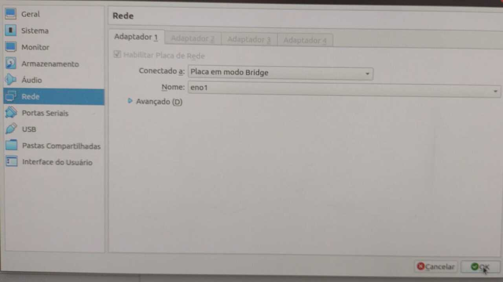

# No terminal das VMs

## 1 - Configuração das NICs

Para que a VMs utilizem a mesma rede interna é necessário acessar as configurações de Rede de cada VM e selecionar o modo ```rede interna``` e definir o nome da rede, vamos escolher ```labredes``` como nome da nossa rede virtual. Utilize o mesmo nome nas duas VMs.

Imagem 01 - Configuração das NICS.


## 2 - Login nas VMs

Entre com as informações:

```
Usuário da VM: administrador
Senha da VM: adminifal
```

## 3 - Configuração estática do endereço IP na interface de rede

Faça tal...


Faça tal...


Faça tal...


Faça tal...


Faça tal...


Faça tal...


Faça tal...


Faça tal...


Faça tal...


## 4 - Configuração da rede interna do VirtualBox

Faça tal...


Faça tal... 


Faça tal...


Faça tal...



Faça tal...


## 5 - Testando o ping entre as duas VMs
