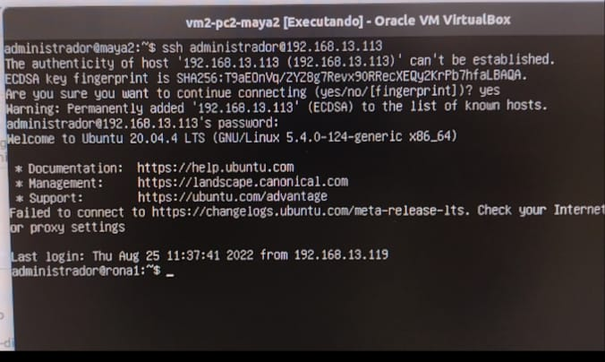

# SSH - Server

Nesta etapa, vamos fazer o acesso remoto SSH entre as VMs, ou seja, conectar-se a um usuário de um PC a partir da VM de outro.

## 1 - Atribuir nomes aos servidores:

Seguindo a tabela da página inicial, antes de criar os novos usuários, temos que alterar os hostname. Para isso, usamos o comando no formato ```sudo hostnamectl set-hostname <hostname>```.

### No PC1:

- VM1: ```sudo hostnamectl set-hostname rona1```
- VM2: ```sudo hostnamectl set-hostname rona2```


A mesma coisa foi feita nas outras máquinas:

#### No PC2:

- VM1: ```sudo hostnamectl set-hostname maya1```
- VM2: ```sudo hostnamectl set-hostname maya2```

#### No PC3:

- VM1: ```sudo hostnamectl set-hostname phil1```
- VM2: ```sudo hostnamectl set-hostname phil2```

#### No PC4:

- VM1: ```sudo hostnamectl set-hostname grup1```
- VM2: ```sudo hostnamectl set-hostname grup2```

## 2 - Instalando servidor SSH

### Antes de Começar:

- acessar as configurações de cada VM e altere novamente o Adaptador1 para NAT
- Comente as linhas de endereço IP estático e ative o DHCP nas configurações do Netplan

## 2.1 - Certificando qeu a VM está acessando a internet:

```
sudo apt update       // atualiza as definições e versões de pacotes/bibliotecas dos repositórios do ubuntu
sudo apt upgrade -y   // atualiza os pacotes com as novas definições e versões 
````

## 2.2 - Instalando o SSH  server:

```
sudo apt-get install openssh-server
systemctl status ssh
```

## 2.3 - Verificando o status das portas:

```
netstat -an | grep LISTEN.  // verifique as conexões TCP na porta 22 se está como LINSTENING
```


## 2.4 - Firewall:

Para garantir o funcionamento correto do controle de acesso devemos configurar o firewall para permitir conexões remota via protocolo SSH, na porta 22.

```
sudo ufw allow ssh    // ativa o ssh no firewall UFW do ubuntu.
sudo ufw status
```


Para ativar o firewall:

```
sudo ufw enable
```


## 2.5 - Criando usuários:

Para criar um usuário é preciso usar o comando:

```
sudo adduser <usuario>   // No lugar de <usuario> imputar o nome do usuário
```

### No PC4

- No PC1: ```sudo adduser ronaldo```
- No PC2: ```sudo adduser mayara```
- No PC3: ```sudo adduser waldemar```
- No PC4: ```sudo adduser grupo8```

Imagem tal - Adicionando usuário ao PC4.


## 3 - Acessando uma VM remotamente:

Para acessar uma VM remotamente pelo SSH é preciso digitar o seguinte comando:

```
ssh <user>@<ipServidorRemoto>
```

Conexão SSH da VM2 do PC2 para a VM1 do PC1:



Fazendo um reboot na VM1 do PC1:


<a href="Imagens/ssh2.mp4" title="Download movie"> Vídeo do processo anterior </a>

VM1 do PC1 reiniciando após o reboot:


<a href="Imagens/reboot4.mp4" title="Download movie"> Vídeo da VM reiniciando </a>

