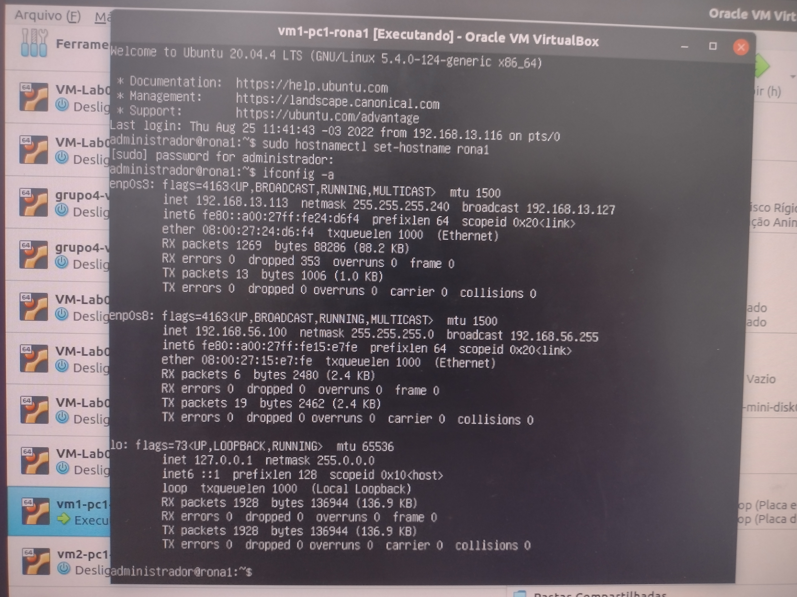
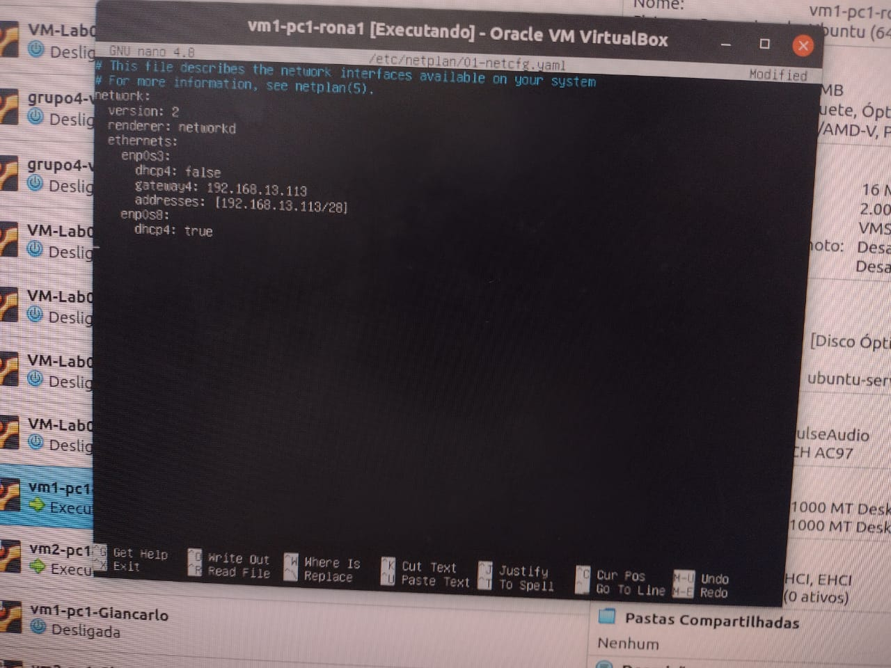

# Acesso à VM via Host-Only

## 1 - Configuração do Host-Only

Para a configuração, deve ser seguidos os seguintes passos:

### 1.1 - No Virtual Box

Ir em arquivo e clicar na opção ```Host Network Manager```


Após, você deve verificar a existência do ```vboxnet0```:


Caso não tenha, você deverá criar o novo adaptador em ```criar```.

- Click em ```Propriedades``` 
- Depois em```Servidor DHCP```
- Após em ```[]Habilitar Servidor```


Entre em uma VM e digite ```ifconfig -a``` e verifique se na saída do comando há o nome do adaptador de rede que foi criado

Desligue sua VM e vá em:

- ```configurações```
- ```Rede```


Habilite um novo adaptador de rede clickando em ```Adaptador <n>``` e depois em ```[] Habilitar placa de rede```.

Logo após inicie a VM e digite o comando ```ifconfig -a```e verifique se na saída do comando há o nome do adaptador de rede que foi criado:



Execute sudo nano /etc/netplan/01-netcfg.yaml
  
Adicione no arquivo ```01-netcfg.yaml```:

   ```dhcp4: true```
   


Execute crtl+x, yes e enter e depois insira o comando ```sudo netplan apply``` para salvar as informações imputadas.
