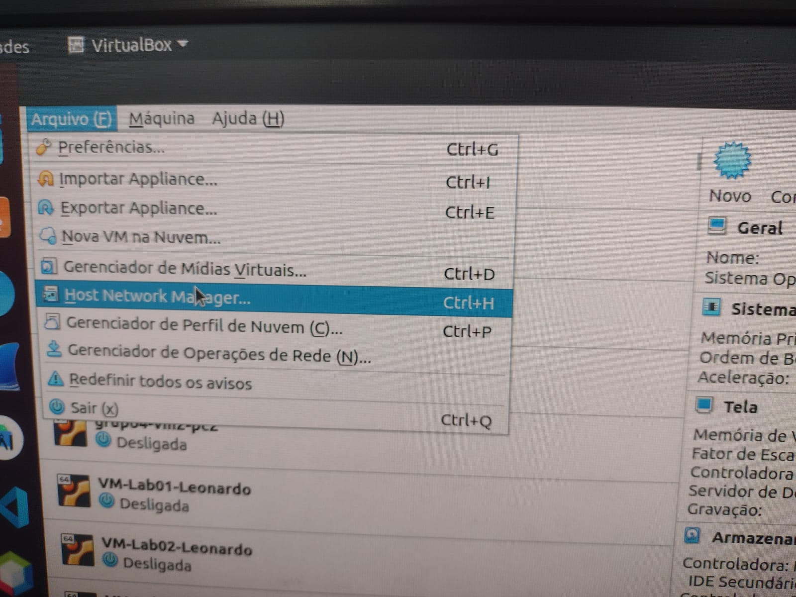
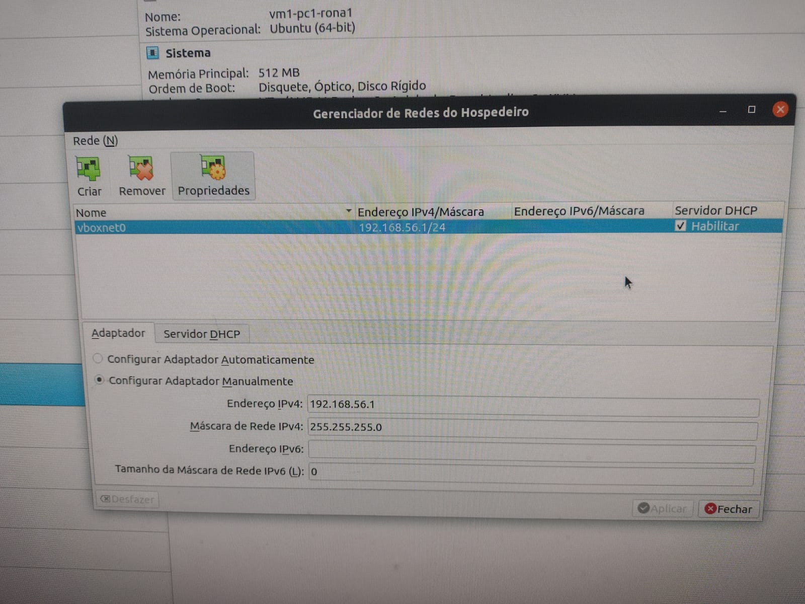
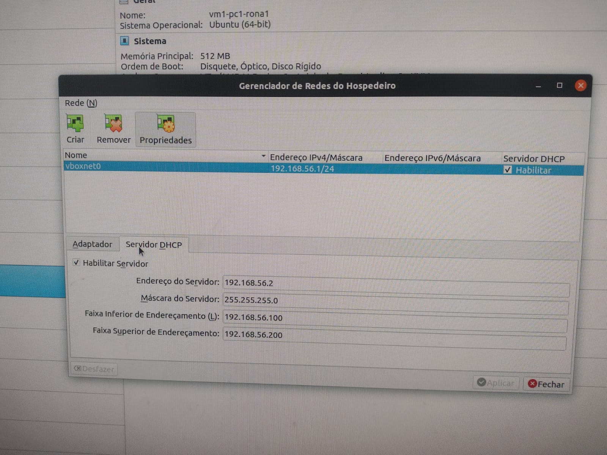
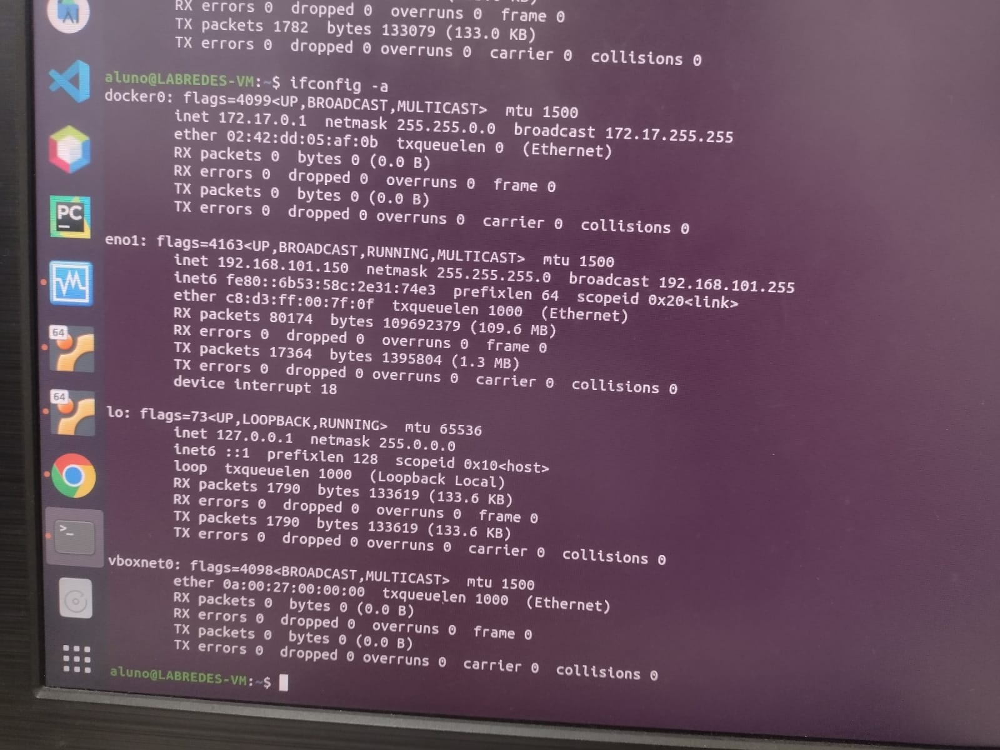

# Acesso à VM via Host-Only

## 1 - Configuração do Host-Only

Para a configuração, deve ser seguidos os seguintes passos:

### 1.1 - No Virtual Box

Ir em arquivo e clicar na opção ```Host Network Manager```



Após, você deve verificar a existência do ```vboxnet0```:



Caso não tenha, você deverá criar o novo adaptador em ```criar```.

- Click em ```Propriedades``` 
- Depois em```Servidor DHCP```
- Após em ```[]Habilitar Servidor```



Entre em uma VM e digite ```ifconfig -a``` e verifique se na saída do comando há o nome do adaptador de rede que foi criado

Desligue sua VM e vá em:

- ```configurações```
- ```Rede```



Habilite um novo adaptador de rede clickando em ```Adaptador <n>``` e depois em ```[] Habilitar placa de rede```.

Logo após inicie a VM.

Digite ifconfig -a

Verifique se na saída do comando há o nome do adaptador de rede que foi criado

Execute cd /etc/netplan/

sudo nano <nome_do_arquivo>.yaml
  
  Adicione no arquivo:

<nome_adaptador_de_rede>:

   dhcp4: true

Execute sudo netplan apply

Verifique no ifconfig -a se as mudanças deram certo

Abrir terminal do pc (sem ser da vm)

ssh <user>@<ip>
  
  imagens e testes
