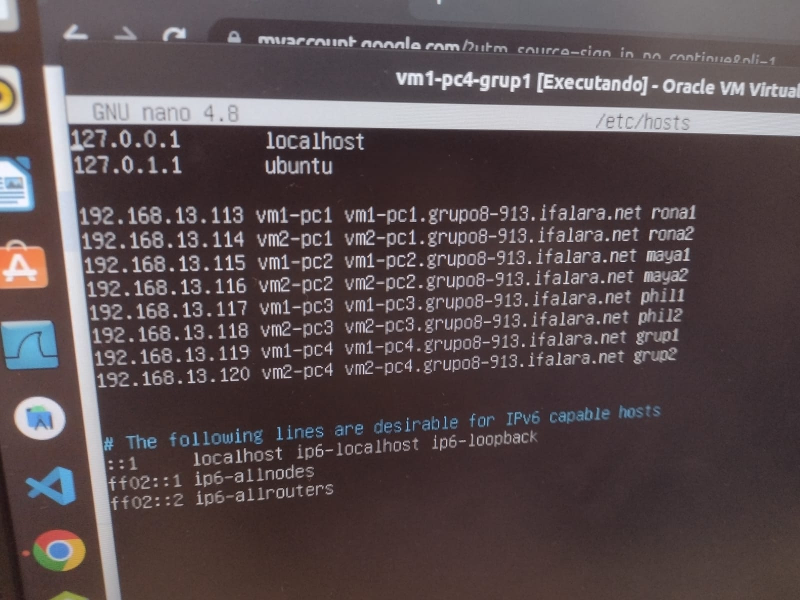

# Configuração estática de Nomes

Nesta parte será preciso editar os arquivos ```/etc/hosts``` conforme as definições da Tabela de Endereços e Nomes da página inicial. Comando:

```
sudo nano /etc/hosts
```

Depois de entrar, só é editar conforme a imagem abaixo:



## 1 - Acessando uma VM remotamente:

Para acessar uma VM remotamente por SSH é preciso digitar o comando nesse formato:

```
ssh <user>@<hostname|FQDN|alias|IP>
```

Acessado VMtal do PCtal da VMtal PCtal:

Comando usado:

```
ssh grupo8@vm1-pc2.grupo8-913.ifalara.net
```


