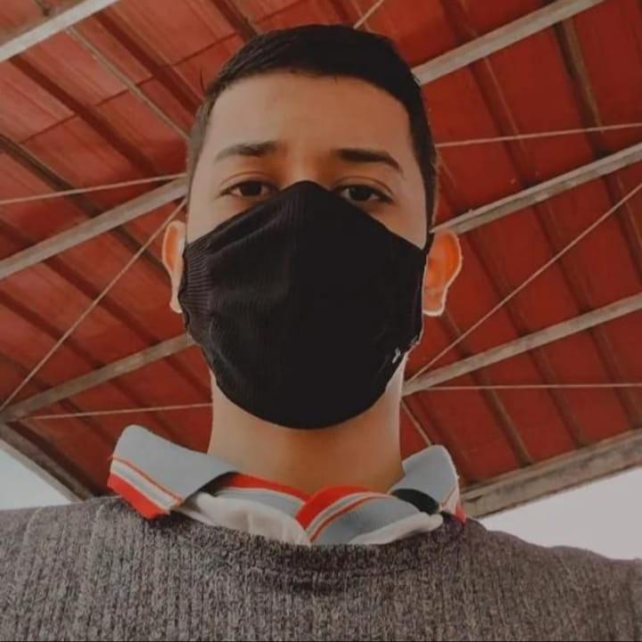

<h1 align="center"> Projeto 2º Bimestre das Disciplinas de Infraestrutura e Serviços de Redes (PRIR/SRED e ISRE) <h1>
 Grupo 08
 
#### Integrantes
 
| [<br><sub>Ronaldo Noberto</sub>](https://github.com/Ronaldo913) |  [<br><sub>Mayara Silva</sub>](https://github.com/mayarinhan) |  [<br><sub>Waldemar Philype</sub>](https://github.com/WPLiraa) |
| :---: | :---: | :---: |

#### Informações:

<table align="center">
    <tr>
        <td align="center">subredes</td>
        <td align="center">rede</td>
        <td align="center">broadcast</td>
        <td align="center">gateway</td>
    </tr>
    <tr>
        <td>192.168.13.[112-127]/28</td>
        <td>192.168.13.112</td>
        <td>192.168.13.127</td>
        <td>192.168.13.113</td>
    </tr>
</table>

```
   Tabela 1: Definições de endereços IPs da Rede e Nomes de Hosts
   ---------------------------------------------------------------------------------------------------
   |  DESCRICAO  |  IP              |   hostname    |           FQDN                 |     aliase     |
   ---------------------------------------------------------------------------------------------------
   | VM1-PC1     | 192.168.13.113   |   vm1-pc1     | vm1-pc1.grupo8-913.ifalara.net |     rona1      |
   | VM2-PC1     | 192.168.13.114   |   vm2-pc1     | vm2-pc1.grupo8-913.ifalara.net |     rona2      |
   | VM1-PC2     | 192.168.13.115   |   vm1-pc2     | vm1-pc2.grupo8-913.ifalara.net |     maya1      |
   | VM2-PC2     | 192.168.13.116   |   vm2-pc2     | vm2-pc2.grupo8-913.ifalara.net |     maya2      |
   | VM1-PC3     | 192.168.13.117   |   vm1-pc3     | vm1-pc3.grupo8-913.ifalara.net |     phil1      |
   | VM2-PC3     | 192.168.13.118   |   vm2-pc3     | vm2-pc3.grupo8-913.ifalara.net |     phil2      |
   | VM1-PC4     | 192.168.13.119   |   vm1-pc4     | vm1-pc4.grupo8-913.ifalara.net |     grup1      |
   | VM2-PC4     | 192.168.13.120   |   vm2-pc4     | vm2-pc4.grupo8-913.ifalara.net |     grup2      |
   ---------------------------------------------------------------------------------------------------
```
### Tutorial da configuração do ambiente de rede virtualizada

* [Etapa 1](https://github.com/Ronaldo913/Projeto-de-ISRE---Ambiente-de-rede/blob/main/Etapa01.md) - Criando os locais de trabalho no terminal
* [Etapa 2](https://github.com/Ronaldo913/Projeto-de-ISRE---Ambiente-de-rede/blob/main/Etapa02.md) - Criando as máquinas virtuais
* [Etapa 3](https://github.com/Ronaldo913/Projeto-de-ISRE---Ambiente-de-rede/blob/main/Etapa03.md) - Configuração estática de endereço IP na interface de rede e conexão ponto a ponto
* [Etapa 4](https://github.com/Ronaldo913/Projeto-de-ISRE---Ambiente-de-rede/blob/main/Etapa04.md) - Roteiro SSH-Server
* [Etapa 5](https://github.com/Ronaldo913/Projeto-de-ISRE---Ambiente-de-rede/blob/main/Etapa05.md) - Host-Only
* [Etapa 6](https://github.com/Ronaldo913/Projeto-de-ISRE---Ambiente-de-rede/blob/main/Etapa06.md) - Nomes estáticos

### Configurações de Hardware 
 
* [Informações do Hardware](https://github.com/Ronaldo913/Projeto-de-ISRE---Ambiente-de-rede/blob/main/Etapa07.md) 

<!-- <a src=>PDF dos Pcs, switch e cabos usados<a/> -->
- <a href="Redes.pdf">PDF dos Pcs, switch e cabos usado</a>
